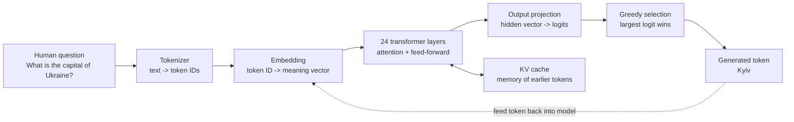
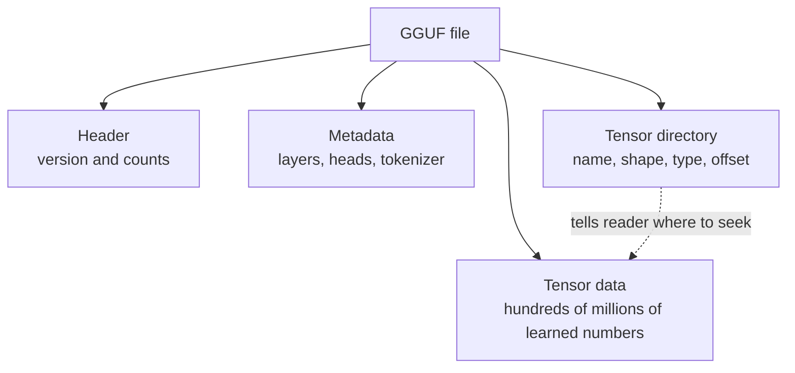
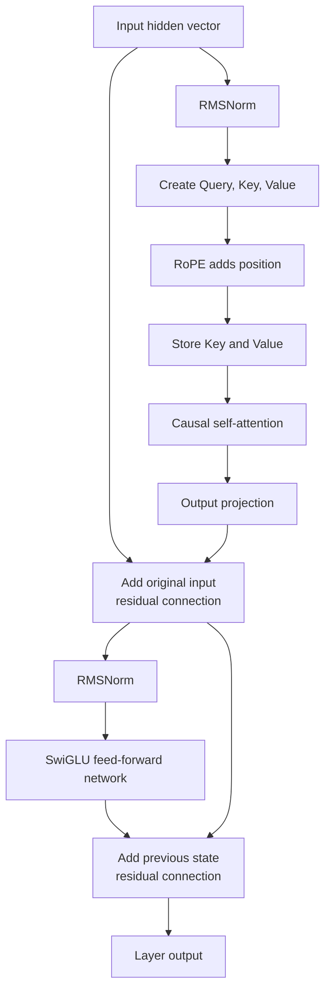
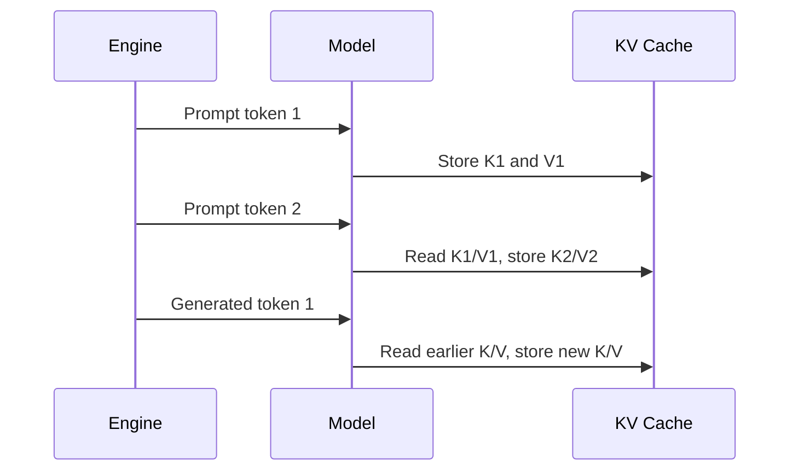
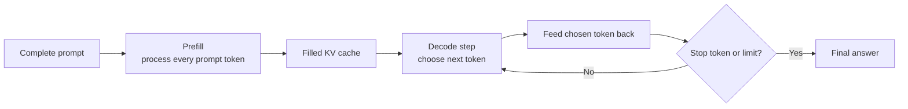

# Build and Understand a Small LLM Inference Engine in C#

This repository is an educational, pure C# implementation of the main steps
needed to run **Qwen 2.5 0.5B Instruct** from an FP16 GGUF model file.

It is written for regular software developers who want to understand what an
LLM engine actually does. The code favors ordinary arrays, loops, descriptive
names, and comments over speed.

> **Goal:** make the path from `"What is the capital of Ukraine?"` to `"Kyiv"`
> visible and understandable.

## What you will learn

By following one generated token through the project, you will see how an
inference engine:

1. Reads model settings and learned numbers from a GGUF file.
2. Converts text into token IDs.
3. Converts a token ID into a meaning vector.
4. Uses self-attention to look at earlier tokens.
5. Processes information through a small neural network.
6. Produces one score for every possible next token.
7. Selects a token, appends it, and repeats.

This project does **not** train a model. Training creates the learned weights.
Inference loads those existing weights and uses them to answer questions.

## Quick start

### Requirements

- .NET 10 SDK
- Several gigabytes of free RAM
- The Qwen model:
  [`qwen2.5-0.5b-instruct-fp16.gguf`](https://huggingface.co/Qwen/Qwen2.5-0.5B-Instruct-GGUF/resolve/main/qwen2.5-0.5b-instruct-fp16.gguf)

The default model path is:

```text
D:\LLMModels\qwen2.5-0.5b-instruct-fp16.gguf
```

Change `defaultModelPath` in
[`Program.cs`](src/SimpleLlmInference.Console/Program.cs) if your file is stored
elsewhere.

### Run the example

```powershell
dotnet run --project src\SimpleLlmInference.Console
```

Run with a different model path and question:

```powershell
dotnet run --project src\SimpleLlmInference.Console -- `
  "D:\LLMModels\qwen2.5-0.5b-instruct-fp16.gguf" `
  "What is the capital of France?"
```

### Run the tests

```powershell
dotnet test
```

The integration test loads the real model, asks for the capital of Ukraine, and
checks that the answer contains `Kyiv`.

Open the test:
[`SimpleInferenceEngineTests.cs`](tests/SimpleLlmInference.Tests/SimpleInferenceEngineTests.cs)

---

## The whole engine in one picture



The engine predicts only **one token at a time**. A full answer appears because
the selected token is fed back into the model and the process repeats.

## Recommended reading path

| Step | Open this code | What to look for |
|---|---|---|
| 1 | [`Program.cs`](src/SimpleLlmInference.Console/Program.cs) | Starts the engine and asks a question. |
| 2 | [`SimpleInferenceEngine.cs`](src/SimpleLlmInference/SimpleInferenceEngine.cs) | Coordinates prompt processing and token generation. |
| 3 | [`GgufReader.cs`](src/SimpleLlmInference/GgufReader.cs) | Reads model settings, tensor shapes, and FP16 weights. |
| 4 | [`QwenTokenizer.cs`](src/SimpleLlmInference/QwenTokenizer.cs) | Converts chat text to token IDs and back. |
| 5 | [`QwenModel.cs`](src/SimpleLlmInference/QwenModel.cs) | Runs embedding, attention, RoPE, feed-forward layers, and logits. |
| 6 | [`TransformerMath.cs`](src/SimpleLlmInference/TransformerMath.cs) | Contains the small mathematical building blocks. |
| 7 | [`Tensor.cs`](src/SimpleLlmInference/Tensor.cs) | Represents a shaped collection of numbers. |
| 8 | [`SimpleInferenceEngineTests.cs`](tests/SimpleLlmInference.Tests/SimpleInferenceEngineTests.cs) | Proves the pieces work together. |

---

## Follow one question through the engine

### 1. Load the model file

Start at
[`SimpleInferenceEngine`](src/SimpleLlmInference/SimpleInferenceEngine.cs).
Its constructor creates:

- a `GgufReader`, which reads the file;
- a `QwenTokenizer`, which understands Qwen's vocabulary;
- a `QwenModel`, which owns the transformer weights and equations.

A model file mostly contains huge tables of numbers. Those numbers are called
**weights**. Training adjusted them until the model became good at predicting
text. Inference does not know facts through `if` statements; knowledge is
distributed across these learned numbers.

### 2. Read GGUF

Open [`GgufReader.cs`](src/SimpleLlmInference/GgufReader.cs).

**GGUF** is a model container format. Think of it as a ZIP-like box designed for
LLMs. It contains:

- metadata such as architecture name and layer count;
- tokenizer vocabulary and merge rules;
- tensor names and shapes;
- the actual learned weight values.



The reader first loads the table of contents. When `Tensor(name)` is called, it
jumps to the tensor's byte offset and reads its values.

### 3. Tokenize the question

Open [`QwenTokenizer.cs`](src/SimpleLlmInference/QwenTokenizer.cs).

The model cannot read C# strings. It reads integer **token IDs**. A token may be
a word, part of a word, punctuation, or whitespace.

Example:

```text
"Ukraine" -> ["Uk", "raine"] -> [31231, 1472]
```

The exact split depends on Qwen's vocabulary.

This tokenizer uses **byte-pair encoding**, usually called **BPE**:

1. Convert text to UTF-8 bytes.
2. Give every byte a safe character representation.
3. Start with tiny pieces.
4. Repeatedly join neighboring pieces using Qwen's learned merge priority.
5. Look up the final pieces in the vocabulary.

The question is wrapped in Qwen's chat template:

```text
<|im_start|>system
You are a helpful assistant...
<|im_end|>
<|im_start|>user
What is the capital of Ukraine?
<|im_end|>
<|im_start|>assistant
```

The final open `assistant` message tells Qwen that its next tokens should be the
answer.

### 4. Convert a token into a vector

Open `Forward(...)` in
[`QwenModel.cs`](src/SimpleLlmInference/QwenModel.cs).

A token ID is just an integer. The first model operation looks up its
**embedding**: a row of learned decimal numbers representing the token.

```text
token ID 42
    |
    v
embedding table row 42
    |
    v
[0.13, -0.44, 0.08, ...]
```

No individual number means "capital" or "Ukraine". Meaning is represented by
the overall direction and pattern of the vector.

### 5. Run a transformer layer

Every transformer layer has two major parts:

1. **Attention:** gather useful information from earlier tokens.
2. **Feed-forward network:** process the gathered information.



This sequence is repeated for every Qwen layer.

### 6. Understand Query, Key, and Value

Attention creates three vectors:

| Vector | Layman meaning | Example |
|---|---|---|
| Query (Q) | What information is the current token looking for? | “I need the country connected to this capital question.” |
| Key (K) | What kind of information does an earlier token contain? | “I represent Ukraine.” |
| Value (V) | What information should be copied if this key is useful? | Contextual information learned for that token. |

The query is compared with every earlier key using a dot product. A higher
score means the vectors point in similar directions and are probably relevant.
Softmax changes the scores into shares that add up to one. The engine then
mixes the value vectors using those shares.

Example attention chart:

| Earlier token | Raw score | Attention share | Interpretation |
|---|---:|---:|---|
| `What` | 0.2 | 5% | Slightly relevant |
| `capital` | 1.5 | 20% | Important |
| `Ukraine` | 3.8 | 70% | Most important |
| `?` | 0.1 | 5% | Slightly relevant |

The percentages above are only an illustration, not values captured from this
model.

### 7. Remember earlier tokens with the KV cache

Open `KvCache` in [`QwenModel.cs`](src/SimpleLlmInference/QwenModel.cs).

Earlier keys and values do not change while generating later tokens. The
**KV cache** stores them instead of recalculating them.



Think of it as keeping notes from previous pages instead of rereading the whole
book before writing every next word.

### 8. Add token position with RoPE

Attention alone sees vectors, but word order matters:

```text
dog bites man
man bites dog
```

**RoPE**, or Rotary Position Embedding, rotates pairs of query and key numbers
by angles based on token position. It is similar to turning clock hands by a
different amount at each position. Because queries and keys are rotated,
attention can detect order and relative distance.

Open `ApplyRope(...)` in
[`QwenModel.cs`](src/SimpleLlmInference/QwenModel.cs).

### 9. Process information with SwiGLU

After attention, each token passes through a wider feed-forward network.

Qwen uses **SwiGLU**:

```text
output = SiLU(gate) * up
```

In plain language:

- `up` creates many possible features;
- `gate` decides which features should pass;
- `SiLU` makes the gate smooth instead of simply on or off;
- `down` compresses the wider result back to the normal hidden size.

Open the feed-forward section inside `Forward(...)` in
[`QwenModel.cs`](src/SimpleLlmInference/QwenModel.cs).

### 10. Produce logits and choose a token

After the final layer, the model creates one **logit** for every vocabulary
token.

| Candidate token | Example logit |
|---|---:|
| `Kyiv` | 12.4 |
| `Kiev` | 8.1 |
| `Paris` | 1.2 |
| `banana` | -3.7 |

A logit is a raw preference score, not a percentage. This project uses
`ArgMax(...)`: select the token with the largest logit.

That is called **greedy decoding**. It is simple and repeatable, but less
creative than probabilistic sampling.

Open `AnswerAsync(...)` and `ArgMax(...)` in
[`SimpleInferenceEngine.cs`](src/SimpleLlmInference/SimpleInferenceEngine.cs).

---

## The generation loop: prefill and decode

LLM inference has two phases.



### Prefill

The engine processes all prompt tokens to build context and fill the KV cache.
No answer is shown yet.

### Decode

The engine repeatedly:

1. Reads the latest logits.
2. Chooses the largest logit.
3. Converts that token to text.
4. Passes the token back through the model.
5. Stops at Qwen's end token or the configured token limit.

---

## Math lab: every helper in `TransformerMath`

Open [`TransformerMath.cs`](src/SimpleLlmInference/TransformerMath.cs) beside
this section. Each video below was checked to be shorter than five minutes.

| C# method | What it does | Why the model needs it | Short video |
|---|---|---|---|
| `MatrixVector(...)` | Applies many weighted recipes to one input vector. | Embeddings must be transformed into Q, K, V, feed-forward features, and logits. | [Matrix Vector Multiplication Explained (4:32)](https://www.youtube.com/watch?v=M1bzMOOq0yo) |
| `RmsNorm(...)` | Keeps a vector's typical size stable. | Values pass through many layers and would otherwise become inconveniently large or small. | [What is RMSNorm? (4:51)](https://www.youtube.com/watch?v=P-ExW9tecKU) |
| `SoftmaxInPlace(...)` | Converts arbitrary scores into positive shares totaling one. | Attention needs understandable weights for mixing earlier value vectors. | [Softmax function - Explained (3:24)](https://www.youtube.com/watch?v=oJU6-qW6xZU) |
| `AddInPlace(...)` | Adds the old vector to newly calculated information. | Residual connections preserve the original signal and add a correction instead of replacing everything. | [Residual Connections Explained (1:11)](https://www.youtube.com/watch?v=QQy8TKmaEho) |

### Matrix-vector multiplication

Suppose the input vector is:

```text
[2, 3]
```

and one matrix row is:

```text
[4, 5]
```

The result for that row is:

```text
2 * 4 + 3 * 5 = 23
```

The row is a learned recipe. A full matrix contains many recipes and therefore
produces many output numbers.

### RMSNorm

RMSNorm calculates the typical magnitude of a vector:

```text
root mean square = sqrt(mean(each value squared) + tiny safety value)
```

Each input is divided by that magnitude and multiplied by a learned weight.
The pattern remains, but its scale becomes predictable.

### Softmax

Given scores:

```text
[1, 2, 4]
```

softmax produces approximate shares:

```text
[4%, 11%, 84%]
```

They are all positive and total 100%. The largest score receives most of the
attention.

### Residual addition

Instead of replacing the old state:

```text
state = newInformation
```

a transformer adds a correction:

```text
state = state + newInformation
```

This creates a clear path for existing information to continue through deep
networks.

---

## Beginner glossary: unfamiliar LLM terms

### Core concepts used by this engine

| Term | What it means in layman terms | Why it is needed |
|---|---|---|
| Inference | Running an already-trained model. | Produces answers without changing the learned weights. |
| Model | Architecture plus learned number tables. | Defines how input tokens become next-token predictions. |
| Weight | A learned decimal number controlling how strongly one value affects another. | The model's learned behavior and knowledge are distributed across weights. |
| Tensor | An array of numbers with a shape. A vector is 1D; a matrix is 2D. | Model weights and intermediate values are stored as tensors. |
| Token | A small text piece represented by an integer ID. | Neural networks work with numbers, not strings. |
| Tokenizer | Translator between text and token IDs. | Prepares questions for the model and converts generated IDs back to text. |
| Vocabulary | The complete list of tokens the model knows how to read and generate. | Every output logit corresponds to one vocabulary item. |
| Embedding | A learned vector representing one token. | Gives the token a mathematical representation of meaning. |
| Hidden state | The current meaning-vector being processed. | Carries information from one transformer layer to the next. |
| Transformer layer | One attention block plus one feed-forward block. | Repeated layers gradually build a useful contextual representation. |
| Attention | A weighted lookup over earlier tokens. | Lets the current token use relevant context from the prompt. |
| Attention head | One independent way of comparing queries and keys. | Different heads can learn different relationships. |
| Grouped-query attention | Several query heads share fewer key/value heads. | Reduces KV-cache memory while keeping multiple query perspectives. |
| Query, Key, Value | Query asks what is needed; key advertises what a token contains; value carries retrievable information. | Together they implement attention. |
| RoPE | Position-dependent rotation of query and key vectors. | Gives attention information about token order and distance. |
| RMSNorm | Rescales a vector to a stable typical size. | Keeps calculations controlled across many layers. |
| SwiGLU | A feed-forward function with a learned gate. | Lets the model create features and decide which ones should pass. |
| Residual connection | Add new information to the old state. | Preserves existing information through deep networks. |
| Logit | Raw score for one possible next token. | Lets the decoder compare all vocabulary choices. |
| Greedy decoding | Always choose the token with the largest logit. | Simple, deterministic generation used by this project. |
| KV cache | Stored keys and values from previous tokens. | Avoids recalculating the complete prompt for every generated token. |
| Context window | Maximum number of tokens the model can consider together. | Limits how much conversation or document text fits at once. |

### File and number formats

| Term | What it means in layman terms | Why it matters here |
|---|---|---|
| GGUF | One file containing model settings, tokenizer data, and weights. | Makes the model portable and lets this engine find named tensors. |
| Floating point | A computer format for decimal-like numbers. | Neural-network calculations use many approximate decimal values. |
| FP32 | A 32-bit floating-point number using four bytes. | Easy for C# to calculate with, but consumes more memory. |
| FP16 | A 16-bit floating-point number using two bytes. | The model file is smaller; this engine expands FP16 weights to FP32 when loading. |
| Precision | How much numeric detail a number format can preserve. | Lower precision saves space but introduces more rounding. |

### Common optimizations deliberately not used

These terms often appear in LLM documentation. This project avoids them so the
core algorithm remains readable.

| Term | Layman explanation | Why production engines use it | Why this project skips it |
|---|---|---|---|
| Quantization | Store weights with fewer bits, often approximately, like shrinking a high-quality image. | Reduces model size and memory use; can improve speed. | It requires extra packed formats and dequantization code that hides the basic math. |
| SIMD | One CPU instruction performs the same operation on several numbers at once. | Makes vector and matrix loops much faster. | Ordinary loops are easier to read and debug. |
| GPU acceleration | Run thousands of small calculations in parallel on a graphics processor. | Matrix operations are highly parallel and much faster on GPUs. | GPU APIs and kernels add a large hardware-specific layer. |
| GPU offload | Keep some model layers on the GPU and the rest in normal RAM. | Allows models larger than GPU memory to run faster than CPU-only inference. | This engine has only one straightforward CPU path. |
| Batching | Process several tokens or user requests together. | Improves hardware usage and server throughput. | One request at a time makes data flow easier to follow. |
| Continuous batching | Add and remove requests from a running batch every generation step. | Keeps production servers busy with many users. | It requires a scheduler and per-request state management. |
| Memory mapping | Let the operating system load file regions only when accessed. | Avoids copying the complete model into managed memory. | Explicit reading is simpler to understand. |
| Paged KV cache | Store cache data in reusable fixed-size blocks instead of one large array. | Reduces wasted memory and supports many concurrent requests. | A flat array makes indexing visible. |
| Flash Attention | Reorganize attention calculations to reduce slow memory traffic. | Greatly improves speed and memory usage. | It combines operations in ways that make the educational steps less visible. |
| Parallelism | Split model work across CPU cores, GPUs, or computers. | Runs larger models and produces tokens faster. | Single-threaded execution is deterministic and easy to trace. |

### Precision and quantization comparison

| Format | Approximate bits per weight | Relative model size | Educational complexity |
|---|---:|---:|---|
| FP32 | 32 | Largest | Simplest arithmetic |
| FP16 | 16 | About half of FP32 | Simple conversion to `float` |
| Q8 | About 8 | About half of FP16 | Requires scales and integer unpacking |
| Q4 | About 4 | About half of Q8 | Requires block formats and more complex reconstruction |

This project accepts FP16 and FP32 GGUF tensors. It intentionally rejects
quantized tensor types with a clear error.

---

## What makes this implementation educational

| Production engine concern | This project |
|---|---|
| Maximum tokens per second | Prefer readable loops |
| Minimum memory use | Prefer ordinary managed arrays |
| Many simultaneous users | Handle one request |
| Multiple model architectures | Support this Qwen architecture |
| Many quantization formats | Support FP16 and FP32 only |
| Hardware-specific kernels | Use plain C# CPU code |
| Random and advanced sampling | Use deterministic greedy decoding |

The result is slow, but every important transformation can be followed in a
debugger.

## Suggested debugging exercise

Set breakpoints in this order:

1. `SimpleInferenceEngine.AnswerAsync`
2. `QwenTokenizer.EncodeChat`
3. `QwenModel.Forward`
4. `TransformerMath.RmsNorm`
5. `QwenModel.Attention`
6. `TransformerMath.SoftmaxInPlace`
7. `SimpleInferenceEngine.ArgMax`

Useful values to inspect:

- `prompt`: the token IDs representing the chat;
- `hidden`: the current token representation;
- `query`, `key`, and `value`: attention vectors;
- `scores`: relevance scores for earlier positions;
- `logits`: one next-token score per vocabulary item;
- `nextToken`: the selected vocabulary ID.

## Limitations

- CPU-only and single-threaded.
- Intentionally slow matrix operations.
- Loads FP16 weights into larger FP32 arrays.
- Supports the tensor names and architecture used by Qwen 2.5.
- No quantized Q4/Q8 tensors.
- No random sampling, temperature, top-k, or top-p.
- No HTTP server, streaming API, batching, or concurrent requests.
- Designed for learning, not production deployment.

## Project structure

```text
src/
  SimpleLlmInference/
    GgufReader.cs             Reads the GGUF model file
    Tensor.cs                 Stores shaped numeric data
    QwenTokenizer.cs          Converts text and token IDs
    TransformerMath.cs        Basic mathematical operations
    QwenModel.cs              Qwen transformer and KV cache
    SimpleInferenceEngine.cs  Autoregressive generation loop

  SimpleLlmInference.Console/
    Program.cs                Small command-line example

tests/
  SimpleLlmInference.Tests/
    SimpleInferenceEngineTests.cs
```

## A final mental model

An LLM inference engine is a loop around a large mathematical function:

```text
question
  -> tokens
  -> vectors
  -> repeated attention and feed-forward layers
  -> scores for possible next tokens
  -> choose one token
  -> repeat until finished
```

The model's intelligence is in the learned weights. The engine's job is to
faithfully load those weights, perform the transformer equations, remember past
tokens, and repeat the next-token prediction loop.
